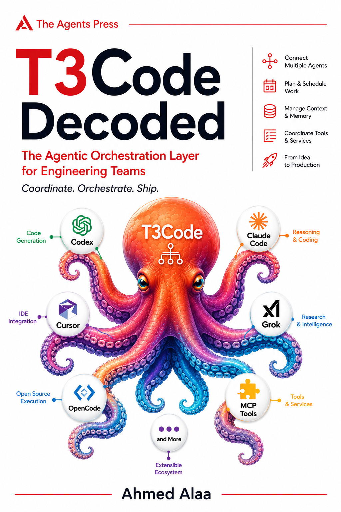

<div align="center">
  

  # T3 Code Decoded

  **A complete product guide and source-grounded interactive guide to T3 Code's architecture and implementation.**

  [Read the book](#read-the-book) · [Explore the plan](./BOOK_PLAN.md) ·
  [Contribute](./CONTRIBUTING.md) · [Source policy](#source-grounding)
</div>

> [!IMPORTANT]
> This is an independent, unofficial study guide. It is not maintained or endorsed
> by Ping Labs or the T3 Code maintainers. Product behavior is described at one
> pinned source revision and may change upstream.

Created and maintained by [Ahmed Alaa (`@BenAlaa`)](https://github.com/BenAlaa).

> [!NOTE]
> The public Pages site is deployed from protected `main`. It reflects the latest
> merged milestone; stacked local authoring branches can be ahead while later parts
> wait for their own reviewed pull requests.
> No authored work is pushed directly to `main`.

## Read the book

[Read the published book](https://benalaa.github.io/t3code-decoded/). When reviewing
an unmerged milestone, run that branch locally with the instructions below—the
published site intentionally tracks protected `main`, not local stacked work.

The book is synchronized with
[`pingdotgg/t3code@859304b78`](https://github.com/pingdotgg/t3code/tree/859304b7808ab9a4be87b1bddcd07c6485bf9c4f),
captured on 11 September 2026.
Every exact excerpt in the book is generated from that revision, checksum-verified,
and linked back to immutable GitHub source lines.

## What this book explains

The product guide explains installation, onboarding, environments, projects,
threads, worktrees, composing with rich context, providers, permissions, files,
terminals, previews, SnapShots, source control, remote access, mobile, device
testing, usage, updates, privacy, complete workflows, and troubleshooting.

The technical guide explains that T3 Code is not the reasoning engine inside Codex,
Claude, Cursor, Grok, OpenCode, or Antigravity. It is the server-authoritative control plane around them: it normalizes
intent, durably records product state, starts and supervises provider runtimes,
projects ordered state to several clients, and surrounds the conversation with
worktrees, Git checkpoints, terminals, files, previews, remote access, usage, and
distribution machinery.

```text
Web · Desktop · Mobile
          │ typed, authenticated Effect RPC
          ▼
T3 server: command → event → projection → reactor
          │                         │
          │                         └─ files · Git · terminal · devices · tunnel
          ▼
ProviderAdapter
          │ native protocol
          ▼
Codex · Claude · Cursor · Grok · OpenCode · Antigravity
```

The book starts with product tasks, then follows that causal path instead of
mirroring repository folders. Its eight parts cover:

1. the complete product guide and task recipes;
2. architecture orientation, ownership boundaries, vocabulary, repository topology, and runtime shapes;
3. CLI/server boot, Effect RPC, pairing, authorization, subscriptions, and resume;
4. commands, events, receipts, projections, reactors, SQLite, and recovery;
5. the provider adapter contract, all six provider integrations, historical usage,
   live context, and subscription limits;
6. projects, worktrees, turns, permissions, plans, tasks, context, memory,
   checkpoints, terminals, files, VCS, MCP, previews, pull requests, and devices;
7. the shared client runtime plus web, Electron, and React Native clients;
8. direct/relay/Tailscale/SSH access, reconnection, packaging, releases, updates, and telemetry.

See [BOOK_PLAN.md](./BOOK_PLAN.md) for the complete 53-chapter specification,
figure/lab inventory, review gates, and definition of done.

## Why another set of docs?

The upstream documentation is primarily a product and operations guide. This book
answers a different class of questions:

- Where is the transaction boundary?
- What does a command receipt actually prove?
- Which state survives a server restart?
- How do six provider integrations become one product vocabulary?
- Why does reconnect logic live above a one-attempt RPC session?
- What is shared across clients, and what deliberately differs?
- Which remote component allocates credentials, and where does application traffic
  really flow?
- Which capabilities ship today, exist only in builders/contracts, or are explicit
  future work?

The explanations include failure windows and discrepancies where prose, comments,
contracts, code, and release automation do not agree.

## Source grounding

The repository treats evidence as build input rather than editorial decoration.

| File | Role |
| --- | --- |
| [`sources/t3code.lock.json`](./sources/t3code.lock.json) | Immutable upstream revision and inventory |
| [`sources/excerpts.manifest.json`](./sources/excerpts.manifest.json) | Exact source ranges selected by authors |
| [`sources/references.manifest.json`](./sources/references.manifest.json) | Pinned file, directory, test, workflow, and documentation anchors |
| [`src/generated/excerpts.json`](./src/generated/excerpts.json) | Generated code, line numbers, and SHA-256 checksums |
| [`scripts/sync-source-excerpts.mjs`](./scripts/sync-source-excerpts.mjs) | Extraction and source-revision guard |
| [`scripts/validate-sources.mjs`](./scripts/validate-sources.mjs) | Manifest/generated-integrity validation |

Claims use four explicit classes:

- **Verified behavior** — backed by executable code, tests, schema, migration, or
  workflow at the source lock.
- **Documented intent** — backed by a pinned upstream document.
- **Inference** — a named interpretation with every input cited.
- **Future / proposed** — explicitly unshipped; never presented as current behavior.

Mechanisms are also classified by durability: transactional, durable but
eventually reconciled, provider-owned and resumable, ephemeral, or best effort.
This matters especially for post-commit reactors, live agent state, checkpoints,
and provider rollback.

## Interactive reading experience

The book is a static Astro site with focused interactivity rather than a client-side
application shell:

- clean, linkable chapter and heading routes;
- typed MDX content and one authoritative content manifest;
- full-text Pagefind search with a development fallback;
- light, dark, and system themes;
- keyboard-accessible navigation and simulations;
- source cards with exact line numbers, checksums, copy, and immutable permalinks;
- lazy diagrams with mouse/trackpad zoom, two-axis pan, drag, and expanded focus mode;
- route-local, keyboard-operable labs with static and print fallbacks;
- responsive layouts, reduced-motion behavior, and print styles;
- base-path-aware URLs for GitHub Pages.

The supplied book cover is reused directly; the site does not generate or alter it.

## Repository layout

```text
.
├── src/content/book/        # ordered MDX chapters
├── src/components/          # figures, source cards, and interactive labs
├── src/layouts/             # book shell and metadata
├── src/styles/              # tokens, reading layout, print/responsive rules
├── src/generated/           # checked-in exact source excerpts
├── sources/                 # upstream lock, excerpt manifest, and reference manifest
├── scripts/                 # source, content, search, and link validation
├── tests/                   # source-pipeline and book invariants
├── .github/                 # quality, Pages, issue, PR, and governance workflows
└── BOOK_PLAN.md             # editorial architecture and delivery gates
```

## Local development

### Requirements

- Node.js 24.10 or newer
- npm
- Git
- Optional: a sibling checkout of `pingdotgg/t3code` at the pinned commit when
  refreshing or independently verifying excerpts

### Start the book

```sh
git clone https://github.com/BenAlaa/t3code-decoded.git
cd t3code-decoded
npm ci
npm run dev
```

The development server prints its local URL.

### Run the quality gates

```sh
npm run source:check
npm test
npm run build
```

`npm run build` validates content and generated evidence, creates the static Astro
site, and builds its Pagefind index.

### Verify against the upstream checkout

Clone T3 Code beside this repository, or point `T3CODE_SOURCE_DIR` at an existing
checkout:

```sh
git clone https://github.com/pingdotgg/t3code.git ../t3code
git -C ../t3code checkout 859304b7808ab9a4be87b1bddcd07c6485bf9c4f
npm run source:check
```

To intentionally refresh generated excerpts after editing the manifest:

```sh
npm run source:sync
```

Never refresh against a different upstream commit without updating the source lock
as a dedicated, reviewed change.

## Contributing

Contributions are welcome for source corrections, clearer explanations, diagrams,
simulations, tests, accessibility, and new evidence discovered at the pinned
revision. Start with [CONTRIBUTING.md](./CONTRIBUTING.md).

The short version:

1. open or find an issue for material architectural changes;
2. branch from `main`—direct pushes are protected;
3. make focused commits using [Conventional Commits](https://www.conventionalcommits.org/);
4. keep excerpts generated and every material claim source-linked;
5. run `npm test` and `npm run build`;
6. open a pull request with a Conventional Commit title and the repository template;
7. resolve review conversations and obtain the required approval before merge;
   the owner may use the audited pull-request-only bypass for a solo-maintained PR.

Chapter corrections should not be bundled with unrelated engine refactors. A book
part may be one review milestone, but its chapters should remain fine-grained
commits so reviewers can inspect the evidence and narrative separately.

## Branch and release policy

`main` is the only default line—there is no duplicate `master` branch. It is
protected by pull-request review, passing book checks, resolved review
conversations, and force-push/deletion restrictions.

`BenAlaa` is the sole owner and initial reviewer. The ruleset grants that account
**pull-request-only** bypass so solo maintenance remains possible without allowing
routine direct pushes: an owner-authored change still needs a PR and leaves its
review and bypass trail on GitHub. Contributions from everyone else require the
configured approval.

GitHub Actions deploys the exact validated `main` artifact to GitHub Pages. Build
output is never committed to the source branch. Source updates, engine changes, and
book-part milestones are reviewed as separate pull requests.

## Attribution and trademarks

T3 Code source excerpts are taken from
[`pingdotgg/t3code`](https://github.com/pingdotgg/t3code), which is distributed
under the MIT License. Each excerpt links to its immutable upstream revision.

“T3 Code,” Ping Labs, Codex, Claude, Cursor, Grok, OpenCode, GitHub, and other
names and marks belong to their respective owners. Their use here is descriptive.
This project does not imply affiliation or endorsement.

## License

- Site engine, scripts, and original code: [MIT](./LICENSE-CODE)
- Original book prose and diagrams: [Creative Commons Attribution 4.0](./LICENSE-CONTENT)
- Upstream excerpts: their original MIT license and notices apply
- Supplied cover artwork: included as a project asset but excluded from both grants

See [NOTICE.md](./NOTICE.md) for the exact attribution boundary.

## Security and conduct

Please use the private reporting path in [SECURITY.md](./SECURITY.md) for a genuine
security issue. Community participation follows [CODE_OF_CONDUCT.md](./CODE_OF_CONDUCT.md).
